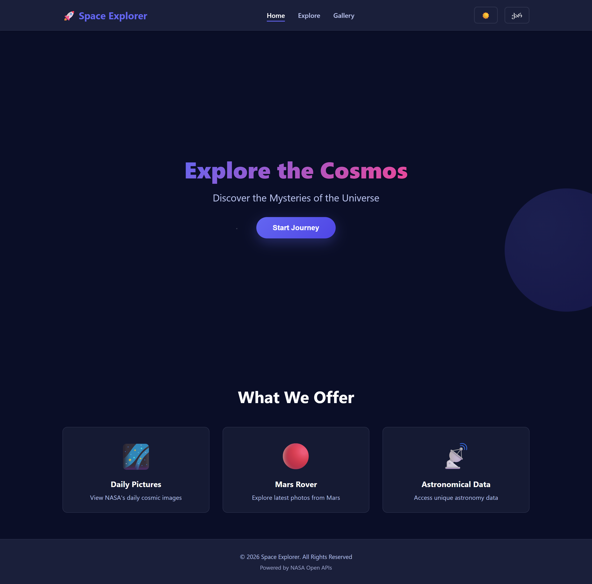
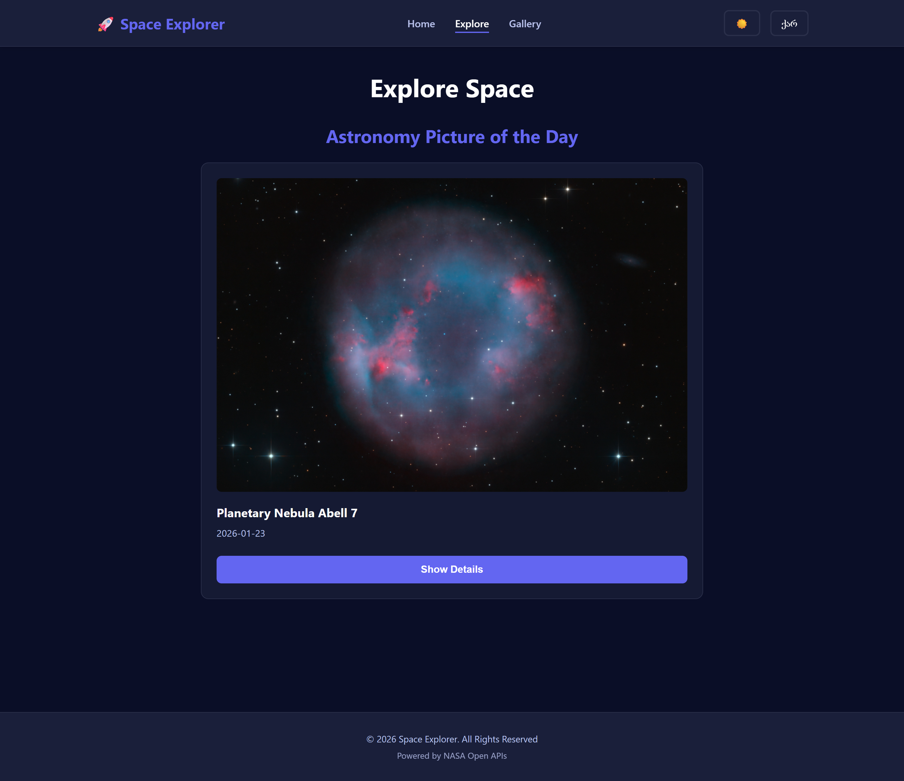
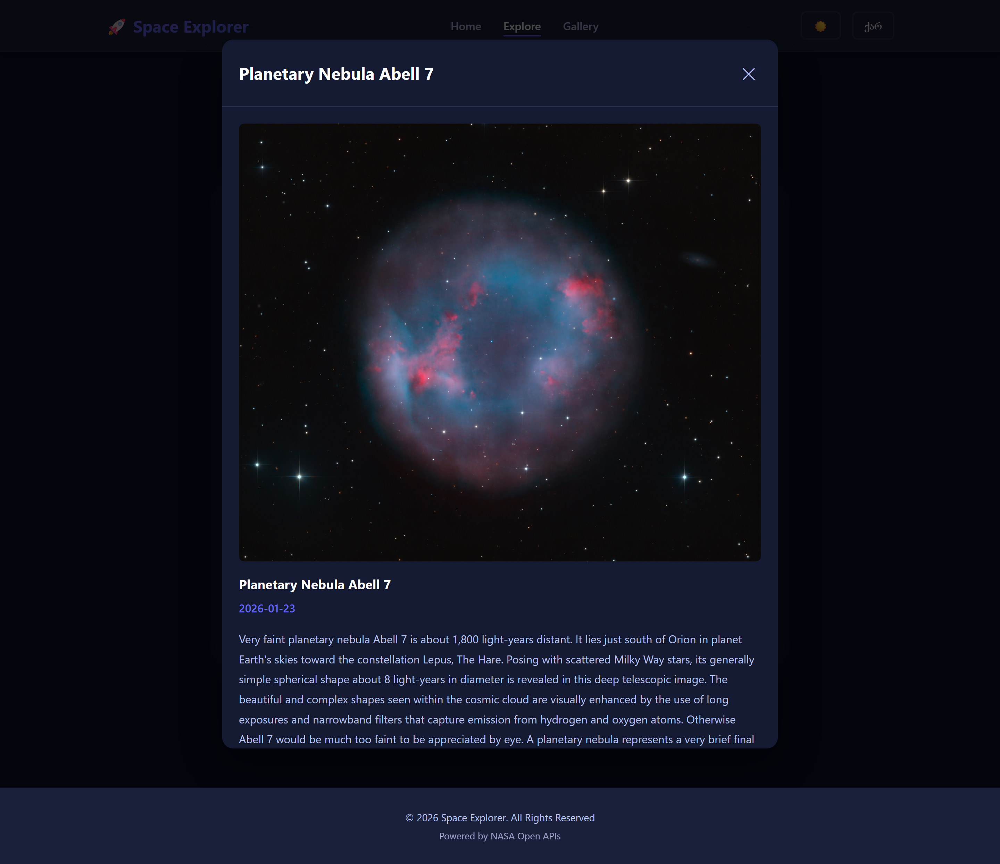
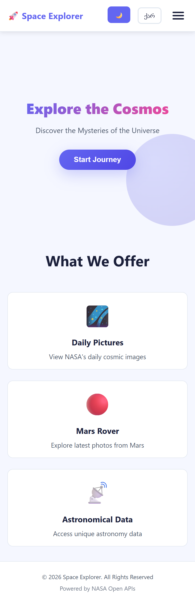

# 🚀 Space Explorer

**Space Explorer** არის React-ზე შექმნილი ვებ აპლიკაცია, რომელიც იყენებს **NASA Open APIs**-ს და გაძლევთ შესაძლებლობას დაათვალიეროთ კოსმოსის საოცარი სურათები, გაეცნოთ მათ ისტორიებს და იმოგზაუროთ სამყაროში პირდაპირ ბრაუზერიდან 🌌

🔗 **Live Demo:**  
👉 https://anakhinchikashvili.github.io/space-explorer/

---

## 📸 Screenshots

### 🏠 Home Page
<p align="center">
  
  
</p>
<p align="center">
  <b>მთავარი გვერდი — მუქი თემა</b> · <b>მთავარი გვერდი — ნათელი თემა</b>
</p>

---

### 🔭 Explore Page
<p align="center">
  
  
</p>
<p align="center">
  <b>NASA Astronomy Picture of the Day (APOD)</b> · <b>დეტალური ინფორმაცია მოდალურ ფანჯარაში</b>
</p>

---

### 🖼️ Gallery Page
<p align="center">
  
  
</p>
<p align="center">
  <b>NASA Mars Rover სურათების გალერეა</b> · <b>სურათის დეტალების ნახვა</b>
</p>

---

### 📱 Responsive Design
<p align="center">
  
</p>
<p align="center">
  <b>მობილური ვერსია</b>
</p>

---

### 🌍 Bilingual Interface
<p align="center">
  
</p>
<p align="center">
  <b>ქართული 🇬🇪 / English 🇺🇸 ენის გადართვა</b>
</p>

---

## ✨ Features

- 🌌 **Astronomy Picture of the Day (APOD)** — ყოველდღიური კოსმოსური სურათები აღწერით  
- 🖼️ **NASA Mars Rover Gallery** — მარსის რეალური ფოტოები  
- 🎨 **Dark / Light Theme** — თემების გადართვა  
- 🌍 **Bilingual** — ქართული და ინგლისური ენები  
- 📱 **Fully Responsive** — Desktop, Tablet, Mobile  
- ⚡ **Fast Performance** — LocalStorage / SessionStorage caching  
- 🎭 **Smooth Animations** — hover effects & transitions  
- 🪟 **Modal Windows** — დეტალური ინფორმაციის ჩვენება  

---

## 📱 Responsive Breakpoints

| Device   | Width Range        |
|----------|--------------------|
| Desktop  | 1200px+            |
| Laptop   | 1024px – 1199px     |
| Tablet   | 768px – 1023px      |
| Mobile   | 320px – 767px       |

---

## 🎨 Design Highlights

- 🌑 Dark space-inspired color palette  
- 🔤 Clean system typography  
- ✨ Animations:
  - Fade In  
  - Slide In  
  - Hover Effects  
  - Loading Spinners  
- 🧩 Reusable & modular component architecture  

---

## 🛠️ Technologies Used

### ⚛️ Frontend
- **React**  
- **React Router**  
- **React Hooks**

### 🌐 API & Data
- **Axios**  
- **NASA APIs**
  - APOD (Astronomy Picture of the Day)  
  - Mars Rover Photos API  

### 🎨 Styling
- **CSS3**  

### 🧠 State Management
- **React Context API**  
- **LocalStorage**  
- **SessionStorage**

### 🚀 Deployment
- **GitHub Pages**

---
## Project Structure

```text
space-explorer/
├── public/
│   ├── index.html
│   └── screenshots/          # Application screenshots
├── src/
│   ├── components/
│   │   ├── layout/
│   │   │   ├── Navbar.js     # Navigation bar
│   │   │   ├── Navbar.css
│   │   │   ├── Footer.js     # Footer component
│   │   │   └── Footer.css
│   │   ├── common/
│   │   │   ├── Card.js       # Reusable card component
│   │   │   ├── Card.css
│   │   │   ├── Modal.js      # Modal dialogs
│   │   │   ├── Modal.css
│   │   │   ├── Loading.js    # Loading spinner
│   │   │   └── Loading.css
│   │   └── pages/
│   │       ├── HomePage.js    # Landing page
│   │       ├── HomePage.css
│   │       ├── ExplorePage.js # APOD page
│   │       ├── ExplorePage.css
│   │       ├── GalleryPage.js # NASA gallery
│   │       └── GalleryPage.css
│   ├── context/
│   │   └── ThemeContext.js    # Theme & Language context
│   ├── hooks/
│   │   └── useLocalStorage.js # Custom hook
│   ├── services/
│   │   └── api.js             # NASA API client
│   ├── utils/
│   │   └── translations.js    # i18n translations
│   ├── App.js                 # Main app component
│   ├── App.css                # Global styles
│   └── index.js               # Entry point
├── package.json
└── README.md
```
---

## 🚀 დაყენება და გაშვება

### 📌 წინაპირობები

პროექტის გასაშვებად დაგჭირდებათ:

* **Node.js** (v14 ან უფრო ახალი)
* **npm** ან **yarn**

---

### 1️⃣ რეპოზიტორიის კლონირება

```bash
git clone https://github.com/anakhinchikashvili/space-explorer.git
cd space-explorer
```

---

### 2️⃣ დამოკიდებულებების დაინსტალირება

```bash
npm install
```

---

### 3️⃣ Development Server-ის გაშვება

```bash
npm run start
```

აპლიკაცია გაიხსნება ბრაუზერში:
👉 **[http://localhost:3000](http://localhost:3000)**

---

### 4️⃣ Production Build

```bash
npm run build
```

---

### 5️⃣ GitHub Pages-ზე Deploy

```bash
npm run deploy
```

---


## 📋 Pages Overview

### 🏠 Home Page
- Hero section animated background-ით  
- Feature cards  
- Scroll animations  
- CTA ღილაკი Explore გვერდზე გადასასვლელად  

### 🔭 Explore Page
- NASA APOD სურათი  
- დეტალური აღწერა  
- Modal სრული ზომის ნახვისთვის  
- SessionStorage caching  

### 🖼️ Gallery Page
- Mars Rover Photos API  
- 12 სურათის grid layout  
- Lazy loading  
- Modal დეტალური ინფორმაციით  
- LocalStorage caching  

---

## 🎨 Theme System

- 🌙 **Dark Mode (default)**  
- ☀️ **Light Mode**  
- Smooth transitions  
- ინახება LocalStorage-ში  

---

## 🌍 Language Support

- 🇬🇪 **ქართული (default)**  
- 🇺🇸 **English**  
- Dynamic translations  
- ინახება LocalStorage-ში  

---

## 👤 Author

**Ana Khinchikashvili**

🔗 GitHub: **@anakhinchikashvili**  
🌍 Project Link:  
https://anakhinchikashvili.github.io/space-explorer/
